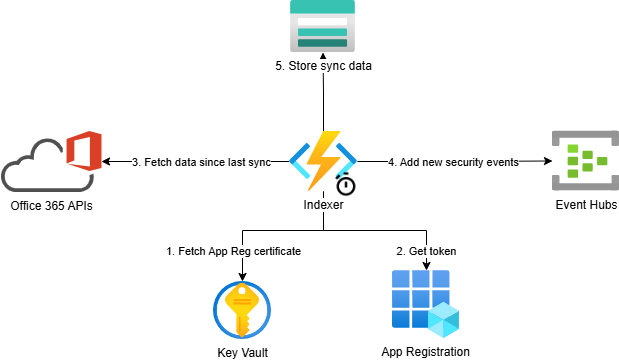

# o365-activity-to-eventhubs

Fetch O365 audit logs and Exchange message traces and publish them to Event Hubs.

Audit logs are fetched from the [Office 365 Management Activity API](https://learn.microsoft.com/en-us/office/office-365-management-api/office-365-management-activity-api-reference) using a Function App, whereas Exchange message traces are fetched Using [Office 365 Reporting web service](https://learn.microsoft.com/en-us/previous-versions/office/developer/o365-enterprise-developers/jj984335(v=office.15)).


## Architecture

This POC relies on the following services:
- Azure Functions: pulling data from data sources (APIs) every 5 minutes (configurable) and adding these events to Event Hubs
- Event Hubs: This is where all security events will be added. You can use a separate hub for each event type or share one event hub for all events.
- Blob storage: Persist the state of succcessful last data synchronizations to enable fetching new data only and be able to retry failed fetch operations.
- App registration: The Application which we will be using to access the reporting APIs of Office 365.
- Key Vault: Ehere we will store the PEM certificate to authenticate the app.
- Azure Monitor: We will rely on Application Insights and Log Analytics to observe the system, understand how the POC is behaving and locate potential issues.




## Pre-requisites

### Azure subscription

You need an Azure subscription for deploying all project resources like Event Hubs, Azure Functions, and other backing resources.

You need to have enough permissions to:
- deploy resources like the [Contributor role](https://learn.microsoft.com/en-us/azure/role-based-access-control/built-in-roles/privileged#contributor) on the subscription or resource group)
- assign RBAC roles like the [User Access Administrator](https://learn.microsoft.com/en-us/azure/role-based-access-control/built-in-roles/privileged#user-access-administrator) or [Role Based Access Control Administrator role](https://learn.microsoft.com/en-us/azure/role-based-access-control/built-in-roles/privileged#role-based-access-control-administrator)


### Network access

If you want to deploy the POC within a VNET, then please make sure that:
- You have access to the VNET so that you can deploy the Function App code. Alternatively, please ensure that a CI/CD pipeline is available for deploying the code of the Function App while using VNETs.
- You can download the npm dependencies defined in package-lock.json (directly from npmjs.org or via a proxy) so that you can package and deploy the Function App code.

### Tools

Ensure that you have the following tools installed:
- [Azure Developer CLI (azd)](https://learn.microsoft.com/en-us/azure/developer/azure-developer-cli/install-azd?tabs=winget-windows%2Cbrew-mac%2Cscript-linux&pivots=os-linux)
- [NodeJS](https://nodejs.org/en)
- [az cli](https://learn.microsoft.com/en-us/cli/azure/)

## Setup

### Resource provisioning

Use `azd` to provision resources:

```sh
azd auth login
azd provision
```

This will create all required resources in Azure.

### Certificate creation

Create a PEM certificate and add it to the deployed instance of Azure Key Vault.

You can follow this [guide](https://learn.microsoft.com/en-us/azure/key-vault/certificates/quick-create-portal#add-a-certificate-to-key-vault) for creating a certificate in Azure Key Vault.

> [!IMPORTANT]  
> The Certificate must be in the PEM format

You can download a copy of this certificate in the CER format for the next step.

> [!IMPORTANT]  
> Download the certificate in the CER format so that you can import it in the App Registration


### O365 App registration

The POC relies on an App registration to access the APIs of Office 365.
The App registration must have access to both `Office 365 Management Activity API` and `Office 365 Reporting web service`.

To do this, please create an App Registration on Entra ID by following this [guide](https://learn.microsoft.com/en-us/office/office-365-management-api/get-started-with-office-365-management-apis#register-your-application-in-microsoft-entra-id).

In addition to the permissions for `Office 365 Management Activity API` described in the guide above, you will also need to do the following steps to grant the App Registration access to the `Office 365 Reporting web service`:

- Update the `API Permissions` of the App Registratyion and assign it the role `ReportingWebService.Read.All`. To do this, you should go to Entra ID, then select `Manage > App registrations`, then click on your App Registration and select `Manage > API Permissions`, then click on `Add permission`, select the tab `APIs my organization uses`, locate and click on `Office 365 Exchange Online`, and then `Application permissions`, and lastly select `ReportingWebService.Read.All`.
- Assign the role `Security Reader` to the App Registration. To do this, you should go to Entra ID, then select `Roles and administrators`, then locate and click on `Security Reader`. Finally, click on `Add assignments`, then `Select member(s)`, and select the App Registration.

### App Registration certificate

Once the App Registration is granted access to both O365 APIs, you will now need to update the App Registration to allow authentication using the PEM certificate that you created before.

Go to the App Registration, then click on the blade menu `Certificates & secrets` then click on `Upload certificate`, and finally import the downloaded CER certificate and save changes.


### Update Function App configuration

Now that the Function App and its dependencies are deployed, we need to update the App Settings of the Function App.

Please check the App Settings of the Function App and make sure all settings look good, you can do this by navigating to the Function App, then selecting the blade menu `Settings`, then clicking on `Environment variables`.

Make sure the field `ENTRA_APP_CLIENT_ID` is set to the Cliend ID of the App registration.

You will also need to update the value of `ENTRA_APP_CLIENT_CERTIFICATE_NAME` and set it to the name of the certificate which you have previously added to the App Registration.

### Deploying the app

Use `azd deploy` to deploy the code of Function App to Azure.

The deployment may take 1 or 2 minutes, but once that is done, the timer function gets triggered you should start getting new O365 audit events in Event Hubs.
